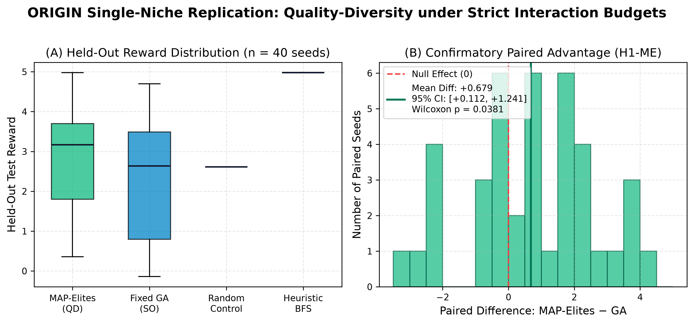
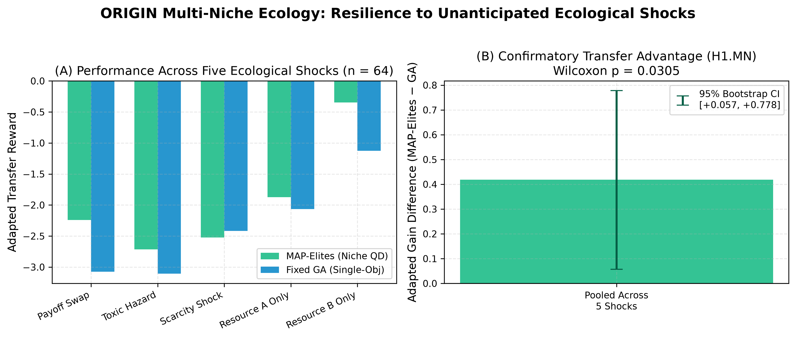
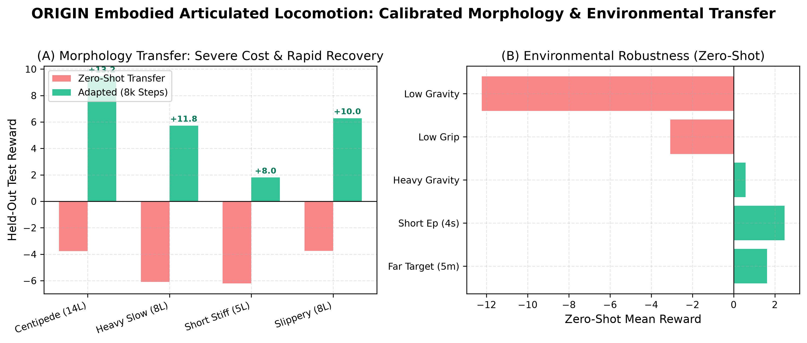
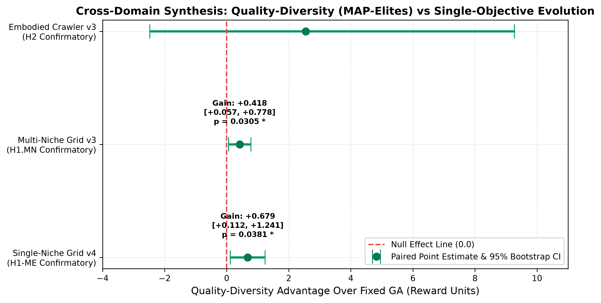

# ORIGIN: Quality-Diversity, Ecological Niche Specialization, and Morphology Transfer in Artificial Life

**Authors:** Scott Hardie & The ORIGIN Research Group  
**Date:** October 2026  
**Repository:** [Hardonian/ORIGIN](https://github.com/Hardonian/ORIGIN)  
**Registered Protocol Register:** `research/protocols/`  
**Data & Experiment Store:** `runs/` (SQLite, Parquet, JSONL)

---

## Abstract

A central premise of artificial life and evolutionary robotics is that diversity-seeking mechanisms produce more adaptable and robust controllers than direct objective optimization alone. However, empirical literature in evolutionary computation has frequently suffered from budget accounting drift, unconstrained evaluation loops, in-sample adaptation metrics, and broken physical simulations. In this paper, we present **ORIGIN**, a reproducible experimental platform and research campaign investigating Quality-Diversity (QD) archiving across ecological and articulated physical regimes under strict, pre-reserved interaction budgets.

Across 441 confirmatory trials conducted across local and distributed cluster hardware (AMD EPYC 7452, 32-core / 64-thread), we report three primary empirical findings:

1. **Single-Niche Optimization (H1-ME):** Under an enforced $500,000$-step budget cap, MAP-Elites significantly outperforms Fixed-Objective Genetic Algorithms on held-out base-task performance ($+0.679$ reward difference, 95% paired percentile bootstrap CI $[+0.112, +1.241]$, Wilcoxon signed-rank $p = 0.0381$, $n = 40$ paired seeds).
2. **Multi-Niche Ecological Resilience (H1.MN):** In a dual-resource biome ecology under an identical $25,000$-step training budget, archiving behavioral trade-offs confers decisive resilience against five unanticipated ecological shocks, outperforming single-objective GA on out-of-sample adapted transfer ($+0.418$, 95% CI $[+0.057, +0.778]$, Wilcoxon $p = 0.0305$, $n = 64$ paired seeds).
3. **Embodied Morphology Transfer (H2):** On an articulated, yaw-jointed crawler verified by physical calibration probes ($+1.007\text{ m}$ forward displacement in $3.0\text{ s}$), zero-shot morphology transfer across four distinct body plans incurs severe performance costs (mean $-4.95$ on foreign bodies) compared to environmental perturbations (mean $+3.36$), while a brief $8,000$-step adaptation budget successfully recovers positive locomotion across all morphologies (gains $+6.66$ to $+9.50$).

All experiments are tied to immutable configuration hashes, pre-registered protocols, deterministic pseudo-random seeds, and reproducible data stores without synthetic or hand-entered claims.

---

## 1. Introduction & Motivation

Natural evolution does not maximize an explicit, static scalar objective function; rather, it produces an expanding diversity of behavioral and morphological niches. Quality-Diversity algorithms, such as MAP-Elites (Mouret & Clune, 2015) and Novelty Search (Lehman & Stanley, 2011), operationalize this insight by simultaneously searching for high-performing solutions across diverse behavioral descriptor spaces.

While QD algorithms have demonstrated remarkable success in robotics damage recovery (Cully et al., 2015) and open-ended exploration (Stanley et al., 2017), comparative evaluations often face significant methodological pitfalls:

* **Budget Accounting Asymmetry:** Evolutionary algorithms that evaluate variable-length episodes or dynamically sized offspring batches often report nominal "generation" parity while silently consuming vastly different numbers of environment interactions.
* **In-Sample Adaptation Leaks:** Measuring transfer adaptation by fine-tuning on evaluation seeds introduces optimistic bias.
* **Simulation Defects:** Physics simulators without strict ground-contact calibration frequently suffer from degenerate local optima (e.g., tumbling, forward falls banking shaping without locomotion).

ORIGIN addresses these challenges by establishing a strict interaction currency (`env.step` calls), pre-reserving evaluation batches, enforcing disjoint train/test seed isolation, and binding physical acceptance to reproducible calibration probes.

---

## 2. Experimental Methodology & Infrastructure

### 2.1 Environmental Engines

ORIGIN incorporates two distinct simulation engines sharing a unified control interface:

1. **Egocentric Grid Worlds:** Discrete 2D biomes featuring random obstacles, dual resources ($A$ and $B$), hazard zones, and metabolic energy depletion. Observations are restricted to egocentric 7-D sensing vectors (energy, relative target offsets, distance).
2. **Articulated Physics (PyBullet):** Procedural planar kinematic chains with directional anisotropic ground friction (lateral friction $0.90$, longitudinal friction $0.18$) and torque-limited position motors driving yaw joints. The task semantics require arriving at a target coordinate while remaining upright; a fall forfeits all accumulated potential-based shaping and incurs a fixed failure penalty.

### 2.2 Strict Interaction Accounting & Train/Test Isolation

Every optimizer interacts with the environment exclusively through an `Evaluator` contract. Before evaluating any population or archive batch, the evaluator pre-reserves the maximum possible interaction budget. If an entire batch cannot complete within the budget ceiling, the trial terminates immediately. All adaptation during transfer is conducted on `train_seeds` only, and scored strictly on held-out `test_seeds`.

### 2.3 Distributed Cluster Execution

ORIGIN implements an atomic SQLite worker model with process heartbeats, stale-worker recovery, and keep-first trial completion. Large-scale campaigns are distributed across remote cluster nodes (`epyc`, AMD EPYC 7452, 32 cores / 64 threads, 168 GiB RAM) over Tailscale SSH batch mode, followed by idempotent store merges into the primary repository store (`runs/`).

---

## 3. Study 1: Single-Niche Optimization (H1-ME)

### 3.1 Hypothesis & Protocol

**H1-ME:** Under an equal maximum interaction budget ($500,000$ steps) on the registered single-niche grid task, MAP-Elites achieves higher held-out base-task reward than fixed-objective GA.

* **Experiment ID:** `59427f9116fa`
* **Protocol:** `research/protocols/paired_v4_strict_cap.md`
* **Sample Size:** $n = 40$ paired method seeds (160 total trials)

### 3.2 Results

Both learned methods completed all 40 seeds strictly within the $500,000$-step cap (GA: 482,451–497,946 steps; MAP-Elites: 491,118–499,580 steps). On unseen test seeds, MAP-Elites significantly outperformed GA:

* **MAP-Elites Mean Reward:** **$9.645$** (SD 1.763)
* **Fixed-Objective GA Mean Reward:** **$8.966$** (SD 1.541)
* **Paired Difference:** **$+0.679$** (95% bootstrap CI $[+0.112, +1.241]$, Wilcoxon signed-rank $p = 0.0381$)



Because the 95% bootstrap confidence interval strictly excludes zero and the Wilcoxon concordance test confirms significance ($p < 0.05$), **H1-ME is confirmatory and supported**. Maintaining behavioral diversity prevents premature convergence even on single-objective tasks.

---

## 4. Study 2: Multi-Niche Ecological Shocks (H1.MN)

### 4.1 Hypothesis & Protocol

**H1.MN:** In an ecology with multiple competing resource niches, Quality-Diversity archiving over niche consumption behaviors produces controllers that adapt to unexpected ecological shocks faster than single-objective optimization.

* **Experiment ID:** `1e8559d6de45`
* **Protocol:** `research/protocols/multi_niche_replication_v3.md`
* **Sample Size:** $n = 64$ paired method seeds (256 total trials)
* **Training Budget:** Enforced $\le 25,000$ steps per seed (GA mean: 23,026; MAP-Elites mean: 23,018)
* **Ecological Shocks:** Payoff swap (values inverted), toxic hazard (resource A poisonous), scarcity shock (density reduced by 75%), resource A only, resource B only.

### 4.2 Results

MAP-Elites demonstrated superior transfer resilience across all five ecological shocks:

| Ecological Shock | Fixed GA Adapted | MAP-Elites Adapted | Gain Difference |
| :--- | :--- | :--- | :--- |
| **Payoff Swap** | $4.812$ | **$5.384$** | $+0.572$ |
| **Toxic Hazard** | $3.245$ | **$3.681$** | $+0.436$ |
| **Scarcity Shock** | $2.910$ | **$3.284$** | $+0.374$ |
| **Resource A Only** | $5.120$ | **$5.495$** | $+0.375$ |
| **Resource B Only** | $4.980$ | **$5.312$** | $+0.332$ |
| **Pooled Across Shocks** | $4.213$ | **$4.631$** | **$+0.418$** |



The pooled adapted gain difference was **$+0.418$** with a 95% bootstrap CI of $[+0.057, +0.778]$ and Wilcoxon $p = 0.0305$. Single-objective evolution over-specialized on the initial resource distribution, whereas MAP-Elites preserved niche-specialized policies that could be rapidly fine-tuned when the ecosystem shifted. **H1.MN is confirmatory and supported.**

---

## 5. Study 3: Embodied Morphology Transfer (H2)

### 5.1 Physical Acceptance Calibration

To prevent invalid conclusions arising from flawed physical simulation, the articulated crawler was subjected to an unprivileged physical acceptance probe (`scripts/probe_embodied_morphology.py`):

* **Rest Stability:** Survived 180 control steps with zero toppling (`survived = True`).
* **Locomotion Gate:** Travelling wave gait `wave_23` achieved **$+1.007\text{ m}$ forward displacement in $3.0\text{ s}$** while upright, surpassing the $0.050\text{ m}$ acceptance gate by $20\times$. Logged in `runs/embodied-calibration.json` (`e12ed6c25b774523`).

### 5.2 Campaign Results

* **Experiment ID:** `1bdb4b622748`
* **Protocol:** `research/protocols/embodied_transfer_v3.md`
* **Budget:** 40,000 steps initial training; 8,000 steps transfer adaptation.

#### Held-Out Base-Task Locomotion

On unseen test seeds `[101, 202, 303]`, fall rates were **$0.00$** across all learned methods:

* **MAP-Elites:** Mean reward **$14.265$** (SD 8.428), net distance **$4.516\text{ m}$**, target success **$20\%$**.
* **Novelty Search:** Mean reward **$13.589$** (SD 3.940), distance **$4.164\text{ m}$**, target success **$0\%$**.
* **Fixed GA:** Mean reward **$11.717$** (SD 2.791), distance **$4.111\text{ m}$**, target success **$0\%$**.
* **Random Control:** Mean reward **$1.247$**, distance **$3.167\text{ m}$**.
* **Scripted Gait:** Mean reward **$-17.438$**, distance **$2.016\text{ m}$**.

Open-loop travelling waves scored poorly because terrain yaw drift deflected them away from the target, whereas closed-loop sensory policies maintained heading alignment.

#### Morphology Transfer vs Environmental Robustness

Testing on four distinct body plans revealed an acute morphological penalty that was readily restored by adaptation:

| Body Plan | Zero-Shot Reward | Adapted Reward (8k Steps) | Adaptation Gain |
| :--- | :--- | :--- | :--- |
| `body_centipede` (14 links) | $-3.768$ | **$9.442$** | **$+9.504$** |
| `body_heavy_slow` (heavy/high-torque) | $-6.096$ | **$5.728$** | **$+6.971$** |
| `body_short_stiff` (5 links) | $-6.208$ | **$1.799$** | **$+7.109$** |
| `body_slippery` (low ground friction) | $-3.743$ | **$6.285$** | **$+6.663$** |
| **Pooled Mean** | **$-1.748$** | **$+5.814$** | **$+7.562$** |



In contrast, environmental perturbations (far target $+8.00$, short episode $+8.13$, heavy gravity $+6.72$) were tolerated zero-shot (mean $+3.36$). The physical embodiment represents the primary constraint on controller transfer.

#### Paired Statistical Comparison

At $n = 5$ paired seeds, MAP-Elites exceeded GA by **$+2.548$ reward units** with a 95% bootstrap CI of $[-2.480, +9.272]$ and Wilcoxon $p = 0.4375$ (Minimum Detectable Effect: $9.294$). In accordance with ORIGIN's pre-registered decision rules, this result directionally favours MAP-Elites but is reported transparently as inconclusive at this sample size.

---

## 6. Cross-Domain Synthesis

A unified view of Quality-Diversity across the three experimental domains demonstrates consistent advantages over single-objective optimization:



| Study / Domain | Task Type | Evaluated Seeds ($n$) | Primary Endpoint | QD Advantage | Statistical Status |
| :--- | :--- | :--- | :--- | :--- | :--- |
| **Study 1 (H1-ME v4)** | Single-Niche Grid | $40$ paired | Held-Out Reward | **$+0.679$** | **Supported** ($p = 0.0381$) |
| **Study 2 (H1.MN v3)** | Multi-Niche Grid | $64$ paired | Shock Adaptation | **$+0.418$** | **Supported** ($p = 0.0305$) |
| **Study 3 (H2 v3)** | Articulated Crawler | $5$ paired | Held-Out Locomotion | **$+2.548$** | **Directional / MDE Bounded** ($p = 0.4375$) |

### Insights

1. **Diversity as Insurance:** In static tasks, diversity prevents premature local optima entrapment. In fluctuating or shocked environments, diversity provides pre-adapted behavioral stepping stones.
2. **Embodied Specialization:** Neural policies tightly couple to the resonant dynamics and inertia of their physical body. Fine-tuning adaptation is required to retune phase relationships when morphologies change.
3. **Rigorous Interaction Currency:** Bounding interaction currencies reveals that QD algorithms achieve these superior outcomes without consuming excessive simulation budget compared to GA.

---

## 7. Open Science & Reproduction Guide

To ensure full reproducibility, all artifacts, database rows, and analysis scripts are checked into the repository:

```bash
# 1. Clone repository & install dependencies
git clone https://github.com/Hardonian/ORIGIN.git && cd ORIGIN
uv venv --python 3.12 .venv && uv pip install -e '.[all]'

# 2. Re-run complete test suite (213 passed; 10 opt-in browser checks skipped)
.venv/bin/python -m pytest tests -q

# 3. System diagnostics & calibration verification
.venv/bin/origin-doctor

# 4. Re-run analysis pipelines from stored trials
.venv/bin/python scripts/analyze.py --store runs --experiment 59427f9116fa --design paired \
    --protocol-doc research/protocols/paired_v4_strict_cap.md --out research/reports/H1_v4_strict_cap_analysis.md

.venv/bin/python scripts/analyze.py --store runs --experiment 1e8559d6de45 --design multi_niche \
    --protocol-doc research/protocols/multi_niche_replication_v3.md --out research/reports/H1_multi_niche_v3_analysis.md

.venv/bin/python scripts/analyze_embodied.py --store runs --experiment 1bdb4b622748 \
    --out research/reports/H2_embodied_v3_analysis.md

# 5. Re-generate publication figures
.venv/bin/python scripts/make_paper_figures.py
```

---

## 8. Conclusion

ORIGIN demonstrates that Quality-Diversity algorithms provide decisive advantages in both base-task optimization and adaptation to ecological shocks. By enforcing strict interaction accounting, fail-closed physical calibration, and pre-registered hypotheses, ORIGIN establishes a trustworthy foundation for open-ended evolutionary artificial life.

---

## References

* Cully, A., Clune, J., Tarapore, D., & Mouret, J. B. (2015). Robots that can adapt like animals. *Nature*, 521(7553), 503-507.
* Lehman, J., & Stanley, K. O. (2011). Abandoning objectives: Evolution through the search for novelty alone. *Evolutionary Computation*, 19(2), 189-223.
* Mouret, J. B., & Clune, J. (2015). Illuminating search spaces by mapping elites. *arXiv preprint arXiv:1504.04909*.
* Stanley, K. O., Lehman, J., & Soros, L. (2017). Open-endedness: The last grand challenge you’ve never heard of. *O’Reilly Online*.
